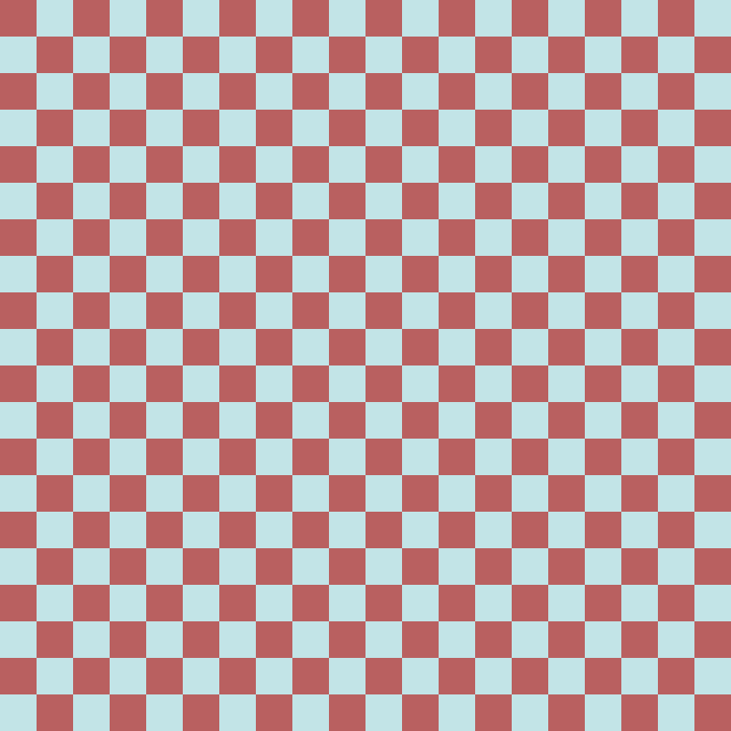
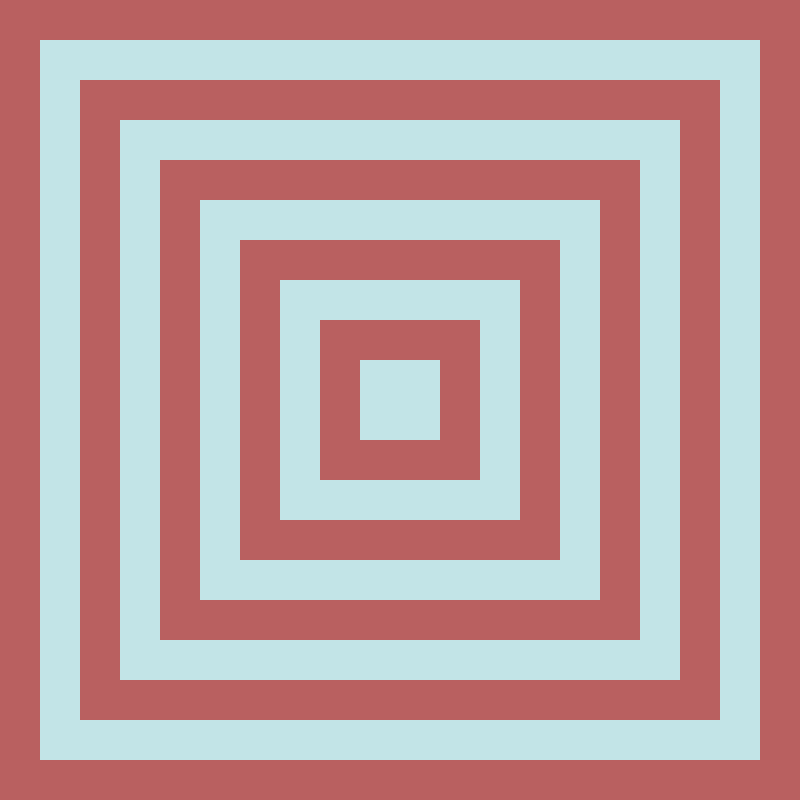
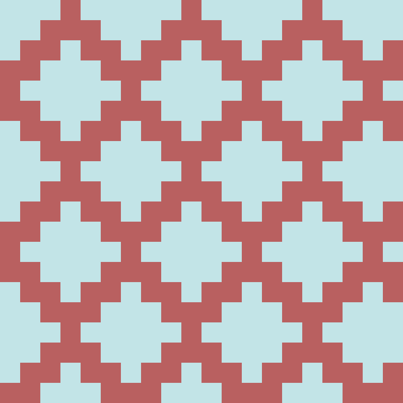
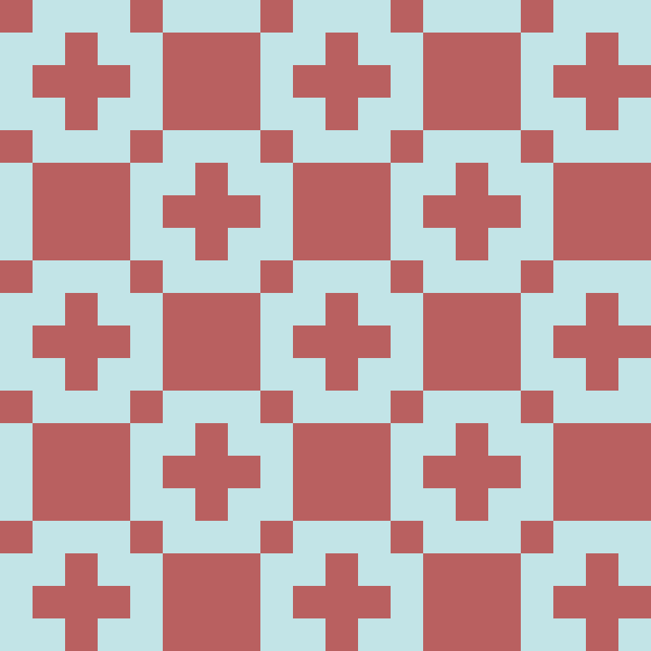

# CS1800-FinalProject
By: Xinyu Wu and Yuhong Zhao

## Discrete Pattern Generator
Webpage: [https://yuhongz12.github.io/CS1800-FinalProject/](https://yuhongz12.github.io/CS1800-FinalProject/)

---------------------------------------

## Overview
For this project, we decided to use one of the first topics we learned in this class — number representation — and create unique art patterns. Inspired by Professor Rachlin’s “Art of Binary Numbers” video, we decided to code a program in which users can create their own personalized art by simply inputting a series of binary and hexadecimal numbers. Albeit being a rather simple concept, and only requiring two user inputs, our program is able to create $2.871 * 10^{17}$ unique artworks.

## Process
Programmed with p5.js, a JavaScript library, users are able to customize the size, colors, and pattern of the image. The input asks for: an 8 bit binary number, a hexadecimal sequence of length 12, and a choice between 4 patterns.  

## Size
In terms of size, the inputted 8-bit long binary sequence represents the number of pixels that make up the width and length of the image. The image is set to be a square of 1000 x 1000 pixels, and the binary input determines how many ‘squares’ will be included in the output image. For example, if the user inputs ‘00001111’, the 1000 x 1000 size square is split into 225 smaller squares, with the width and height being 15 equal-sized ‘pixels’. Thus, the number of squares in the pattern can range from 1 (input: 00000001) to 65025 (input: 11111111). This makes up a total of 255 possible binary size inputs, with the size of 0 (input: 00000000) outputting no image.

```
Input: 00010100  20
Size of Pattern: 20 x 20 squares
```

## Color
To form the pattern, each of the squares is assigned a color based off of the user’s 12-bit long hexadecimal input and the pattern that they choose. The hexadecimal string is split in the middle, forming two different hexadecimal strings of length 6. Each of these represents a color (Color 1 and Color 2) in hexadecimal form and are used to develop the different patterns.

```
Input: B96060C2E4E7 -> B96060|C2E4E7
Color 1: #B96060 
Color 2: #C2E4E7
```

## Pattern
After inputting a binary number and hexadecimal string that determine size and color, respectively, the user chooses from a drop-down list of 4 patterns, named Checkerboard, Spiral, Diamond, and Cross.

1. The checkerboard, as the name suggests, is a pattern in which Color 1 and Color 2 alternate in each row. Directly adjacent squares — top, bottom, left, right — are of the opposite color. To create this pattern, the program assigns Color 1 and Color 2 to an array (which represents the pattern) using two comparative for loops. For each position in the array, if the row and column values’ modulus of 2 is the same, then they are assigned to Color 1. Otherwise, they are assigned to Color 2.  



2. For the spiral pattern, we created a layered series of squares in which each ‘layer’ is an alternating color from the previous. In order to do so, we resize the canvas for each layer and assign a color to cover the entirety of that layer. Then, we create the next layer by subtracting two pixels from the inputted size to create a smaller square of the opposite color. To determine the color, we used a `for` loop, and added to a count `i` which increased for each additional layer. By taking the count’s modulus of 2, we were able to determine the right color for the square.  


3. In order to create the ‘diamond’ pattern, we first create a two dimensional row-major square array/matrix of the inputted size. Starting with an array of all Color 1, we changed certain positions to Color 2 based on their modulus, while all others stayed as Color 1. Using an outer for loop to go through each of the rows (i), and an inner loop to go through each row’s corresponding column (j), we determined the color of each pixel based on the i value’s modulus of 8 and j value’s modulus of 6. We assigned the outputted color to `grid[i][j]` of the matrix.  


4. The cross pattern uses a very similar approach to the diamond pattern, but with different comparisons to determine the color. We used two for loops comparing the row (i) modulus of 8 and column (j) modulus of either 8 or 4. The column value is modulus of 4 when `i % 8 == 0` or  `i % 8 == 4`; otherwise it is calculated as the modulus of 8.  


## Total Number of Unique Patterns
After playing around with our completed pattern art application, we were curious as to how many different unique art patterns could be developed using this program. So using basic combinations formulas that we learned in class, we were able to calculate the total number of possible patterns.

1. Find number of different ‘sizes’ of the pattern (8-bit Binary Number).   
Possible inputs: `00000001 -11111111 `  
$S = (2)8=256$ possible sizes including 0  
$S = 256-1=255$ possible sizes discounting 0


2. Calculate number of different color combinations (16-bit Hexadecimal Number).  
Possible inputs: `000000000000 -FFFFFFFFFFFF `  
$C = (16)12=2.814 x 10^{14}$ possible color combos

3. Solve for total number of possible combinations, with 4 different patterns  
`T = (SizeColorsPatterns)-(repeated solid square patterns)`  
$T=[255 * (2.814 \cdot 10^{14} )*4]-[25 * 16 * 3]$  
$T \approx 2.871 \cdot 10^{17}$ total possible patterns

With a total of $2.871 \cdot 10^{17}$ unique patterns, our program is pretty powerful in the sense that it is unlikely that any two people will develop the same pattern. While the 17th power is not a named large number, it is somewhere between a Quadrillion (17th power) and a Quintillion (18th power). While trying to better understand the size of this number, we discovered that it is comparable to the total storage used by Gmail (aggregate of all Gmail accounts’ storage) as of 2012. 

## Conclusions + Connection
In completing this project, we were able to apply a few different discrete mathematics concepts that we learned in class. For the size and color of the pattern, we used binary and hexadecimal number representation. Although not taught this semester, modulus arithmetic is a common discrete math topic that we used to develop the different patterns. Furthermore, we also used combinatorics to calculate the total possible patterns created by our program. In terms of the runtime of our program, the spiral pattern function uses one `for` loop and thus has a linear runtime, or $O(n)=n$, while the other three pattern functions (checkerboard, diamond, cross) are quadratic-time, $O(n)=n^2$ because they use two nested `for` loops which each incrementally go through every value of the inputted binary size. In completing this project, we’ve deepened our understanding in a number of discrete math topics, and have discovered how many comparisons and moduluses it can take to create rather simple patterns. Going into the future, we hope to further explore patterns such as creating the spiral with different shapes, or making the size of each color in the checkerboard flexible, and not just alternating by pixel; another possible expansion would be to allow for more than two input colors, which could create kaleidoscopic art images.